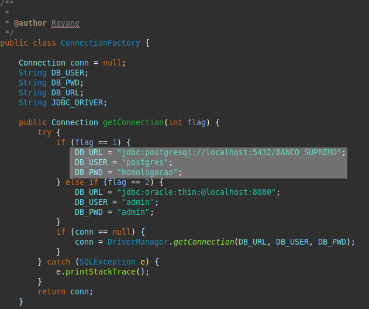
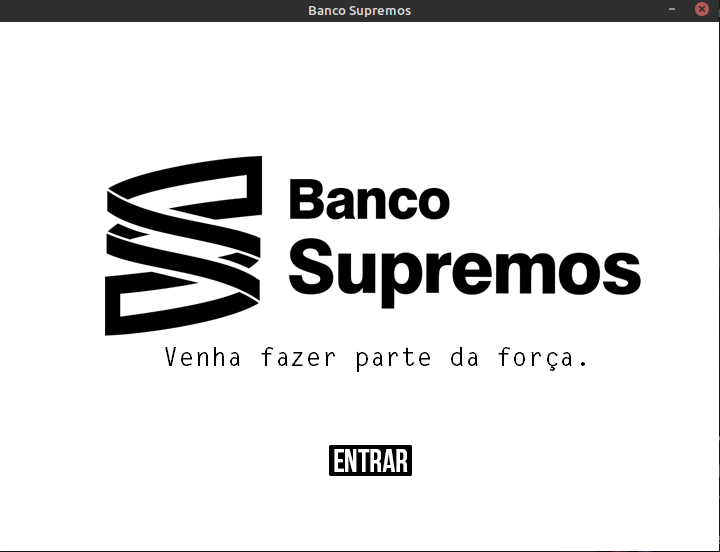
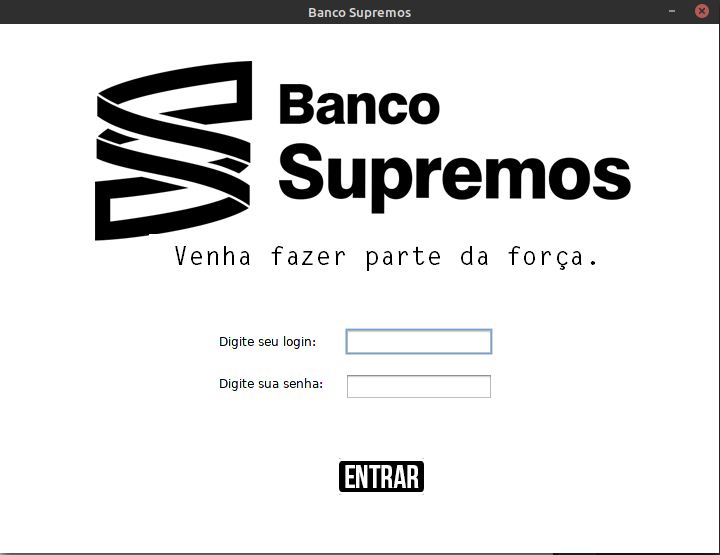
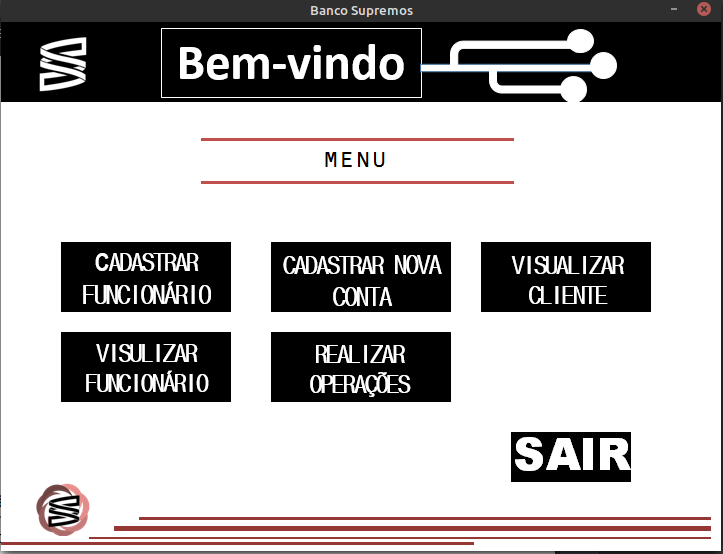

# Banco Supremos
Trabalho da disciplina de banco de dados desenvolvido no curso técnico em informática do IFRN em 2016 como projeto final da disciplina.

## Tecnologias
1. Java
2. PostgreSQL

## Informações gerais
Esse projeto apresenta um banco financeiro simples usando Java com banco de dados PostgreSQL.  

## Executando o projeto
Para executar o projeto, primeiramente clone esse repositório em sua máquina e abra-o no Eclipse.  

Depois, crie um banco de dados Postgres chamado **BANCO_SUPREMO** e execute nele o script de criação das tabelas que está localizado no arquivo `database/bancoSupremos.sql`. 

Acesse o arquivo chamado **ConnectionFactory.java** `br.com.classesDAO` e altere o valor das variáveis *DB_USER* e *DB_PWD* para o username e o password, respectivamente, do seu banco de dados, como mostra a área em branco do exemplo abaixo:

Feito isso, execute o arquivo **BancoSupremoApplication.java**. Você será direcionado para a tela inicial do sistema como mostra a Figura 1 a seguir.

Ao clicar no botão *Entrar*, você será direcionado para a tela de login (Figura 2). 

Por padrão, no nosso script de criação da tabela, um funcionário padrão foi criado com login = **AlvesRayane** e senha = **123456**. Digite essas informações e acessará o sistema como um gerente inicial (Figura 3).

E pronto, agora você pode acessar as funcionalidades do sistema.
